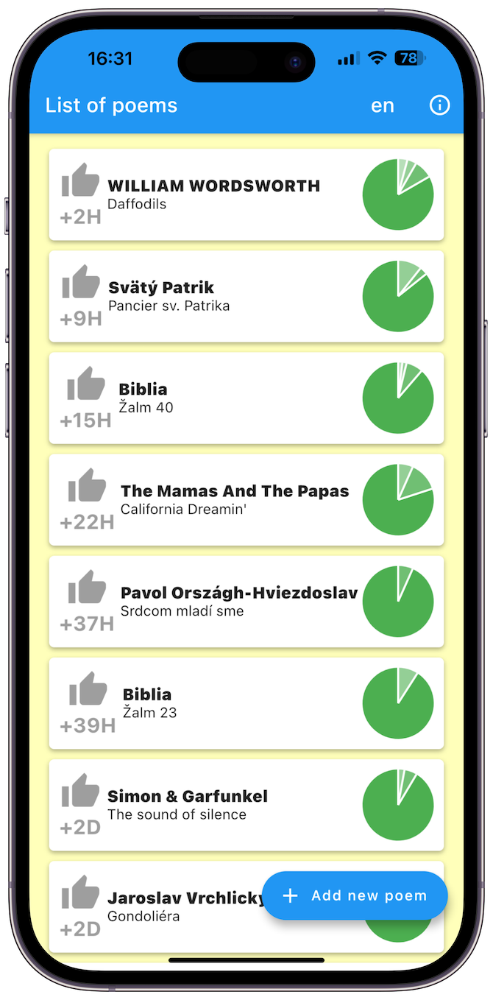

# poem

An flutter application for learning poems using the spaced repetition method 

Apple Store: https://apps.apple.com/us/app/poems-memorize-poetry-texts/id1509333489 

Google Play: 

# first app

This is my first application in flutter from 2020 when I was learning flutter during the pandemic. It contains a lot of bugs and some things are programmed not very cleanly. 

I adapted the app to the new version of flutter after 4 years in 2024, so that it can be compiled and run. And I also made sure to publish this new version on the Apple Store and Google Play.

The reason for publishing it as open source is that some users use it to learn the seed phrase for their crypto wallets and want to make sure the app doesn't send data anywhere. 

So now it's visible in the source code that it doesn't send. Alternatively, they can now install it directly from the source codes and not have to use the version on the App Store.

